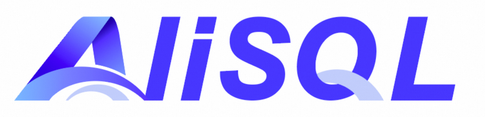

<p align="center">
  
</p>

<h1 align="center">AliSQL</h1>

<p align="center">
  <strong>阿里巴巴企业级 MySQL 分支 - 集成 DuckDB OLAP 引擎与原生向量搜索</strong>
</p>

<p align="center">
  <em>经阿里巴巴生产环境大规模验证，支撑数百万数据库实例稳定运行</em>
</p>

<p align="center">
  <a href="https://github.com/alibaba/AliSQL/stargazers"></a>
  <a href="https://github.com/alibaba/AliSQL/network/members"></a>
  <a href="https://github.com/alibaba/AliSQL/blob/master/LICENSE"></a>
  <a href="https://github.com/alibaba/AliSQL/releases"></a>
</p>

<p align="center">
  <a href="#核心特性">特性</a> •
  <a href="#快速开始">快速开始</a> •
  <a href="#文档">文档</a> •
  <a href="#路线图">路线图</a> •
  <a href="#参与贡献">贡献</a>
</p>

<p align="center">
  <a href="./README_zh.md">简体中文</a> | <a href="./README.md">English</a>
</p>

## 为什么选择 AliSQL？

AliSQL 为 MySQL 带来企业级能力，将 InnoDB 可靠的 OLTP 性能与 DuckDB 极速的分析能力和原生向量搜索相结合 - 全部通过熟悉的 MySQL 接口使用。

<table>
<tr>
<td width="33%" align="center">

### 分析性能提升 200 倍

DuckDB 列式引擎相比 InnoDB，分析查询性能提升 **200 倍**

</td>
<td width="33%" align="center">

### 原生向量搜索

内置 HNSW 算法，支持高达 **16,383 维**向量，满足 AI/ML 工作负载

</td>
<td width="33%" align="center">

### 100% MySQL 兼容

使用现有的 MySQL 工具、驱动和 SQL - 零学习成本

</td>
</tr>
</table>

## 核心特性

| 特性 | 描述 | 状态 |
|------|------|------|
| **DuckDB 存储引擎** | 列式 OLAP 引擎，支持自动压缩，专为分析场景设计 | 已发布 |
| **向量索引 (VIDX)** | 原生向量存储与 ANN 搜索，基于 HNSW 算法，支持余弦和欧氏距离 | 已发布 |
| **DDL 优化** | Instant DDL、并行 B+树构建、非阻塞锁机制 | 规划中 |
| **RTO 优化** | 加速崩溃恢复，缩短实例启动时间 | 规划中 |
| **复制增强** | Binlog 并行刷盘、Binlog in Redo、大事务优化 | 规划中 |

## 快速开始

### 方式一：从源码构建

```bash
# 克隆仓库
git clone https://github.com/alibaba/AliSQL.git
cd AliSQL

# 构建（release 模式）
sh build.sh -t release -d ~/alisql

# 安装
make install
```

### 方式二：搭建 DuckDB 分析节点

> **详细指南：** [如何搭建 DuckDB 节点](./wiki/duckdb/how-to-setup-duckdb-node-cn.md)

### 初始化并启动服务

```bash
# 初始化数据目录
~/alisql/bin/mysqld --initialize-insecure --datadir=~/alisql/data

# 启动服务
~/alisql/bin/mysqld --datadir=~/alisql/data
```

## 使用示例

### 使用 DuckDB 进行数据分析

```sql
-- 创建使用 DuckDB 引擎的分析表
CREATE TABLE sales_analytics (
    sale_date DATE,
    product_id INT,
    revenue DECIMAL(10,2),
    quantity INT
) ENGINE=DuckDB;

-- 执行复杂分析查询（比 InnoDB 快 200 倍！）
SELECT
    DATE_FORMAT(sale_date, '%Y-%m') as month,
    SUM(revenue) as total_revenue,
    COUNT(*) as transactions
FROM sales_analytics
GROUP BY month
ORDER BY total_revenue DESC;
```

### 使用向量搜索构建 AI 应用

```sql
-- 创建包含向量列的表
CREATE TABLE embeddings (
    id INT PRIMARY KEY,
    content TEXT,
    embedding VECTOR(768)  -- 768 维向量
) ENGINE=InnoDB;

-- 创建 HNSW 索引以加速 ANN 搜索
CREATE VECTOR INDEX idx_embedding ON embeddings(embedding);

-- 使用余弦距离查找相似项
SELECT id, content,
       COSINE_DISTANCE(embedding, '[0.1, 0.2, ...]') as distance
FROM embeddings
ORDER BY distance
LIMIT 10;
```

## 构建选项

| 选项 | 描述 | 默认值 |
|------|------|--------|
| `-t release\|debug` | 构建类型 | `debug` |
| `-d <目录>` | 安装目录 | `/usr/local/alisql` |
| `-g asan\|tsan` | 启用内存/线程检测器 | 禁用 |
| `-c` | 启用代码覆盖率 (gcov) | 禁用 |

**前置依赖：** CMake 3.x+、Python 3、GCC 7+ 或 Clang 5+

## 路线图

```
2025 Q4  ━━━━━━━━━━━━━━━━━━━━━━━━━━━━━━━━━━━━━━━━━━━━━━━━━━━━━━━━━━━━━━━━━
         [x] DuckDB 存储引擎        [x] 向量索引 (VIDX)        [x] 开源发布

2026     ━━━━━━━━━━━━━━━━━━━━━━━━━━━━━━━━━━━━━━━━━━━━━━━━━━━━━━━━━━━━━━━━━
         [ ] DDL 优化               [ ] RTO 优化               [ ] 复制增强
             - Instant DDL              - 快速崩溃恢复             - Binlog 并行刷盘
             - 并行 B+树构建             - 最小化 RTO               - Binlog in Redo
             - 非阻塞锁机制                                        - 大事务优化
```

## 文档

| 文档 | 描述 |
|------|------|
| [DuckDB 集成指南](./wiki/duckdb/duckdb-cn.md) | DuckDB 存储引擎完整使用指南 |
| [向量索引指南](./wiki/vidx/vidx_readme.md) | 原生向量存储与 ANN 搜索 |
| [发布说明](./wiki/changes-in-alisql-8.0.44.md) | AliSQL 8.0.44 新特性 |
| [搭建 DuckDB 节点](./wiki/duckdb/how-to-setup-duckdb-node-cn.md) | 快速搭建分析节点指南 |

**外部资源：**
- [MySQL 8.0 官方文档](https://dev.mysql.com/doc/refman/8.0/en/)
- [DuckDB 官方文档](https://duckdb.org/docs/stable/)
- [技术详解文章](https://mp.weixin.qq.com/s/_YmlV3vPc9CksumXvXWBEw)

## 参与贡献

AliSQL 于 2025 年 12 月正式开源，由阿里云数据库团队持续维护。

我们欢迎各种形式的贡献！

1. **Fork** 本仓库
2. **创建** 功能分支 (`git checkout -b feature/amazing-feature`)
3. **提交** 你的修改 (`git commit -m 'Add amazing feature'`)
4. **推送** 到分支 (`git push origin feature/amazing-feature`)
5. **发起** Pull Request

如有 Bug 反馈或功能建议，请通过 [GitHub Issues](https://github.com/alibaba/AliSQL/issues) 提交。

## 社区与支持

<table>
<tr>
<td align="center" width="50%">

**GitHub Issues**

Bug 反馈与功能建议

[提交 Issue](https://github.com/alibaba/AliSQL/issues)

</td>
<td align="center" width="50%">

**阿里云 RDS**

托管的 DuckDB 分析型实例

[了解更多](https://help.aliyun.com/zh/rds/apsaradb-rds-for-mysql/duckdb-based-analytical-instance/)

</td>
</tr>
</table>

## 开源协议

AliSQL 采用 **GPL-2.0** 协议开源，与 MySQL 保持一致。

详见 [LICENSE](LICENSE) 文件。

## Star 趋势

<p align="center">
  <a href="https://star-history.com/#alibaba/AliSQL&Date">
    
  </a>
</p>

<p align="center">
  由 <a href="https://www.alibabacloud.com/product/apsaradb-for-rds-mysql">阿里云数据库团队</a> 精心打造
</p>

<p align="center">
  <a href="https://github.com/alibaba/AliSQL">GitHub</a> •
  <a href="https://github.com/mysql/mysql-server">MySQL</a> •
  <a href="https://github.com/duckdb/duckdb">DuckDB</a>
</p>
